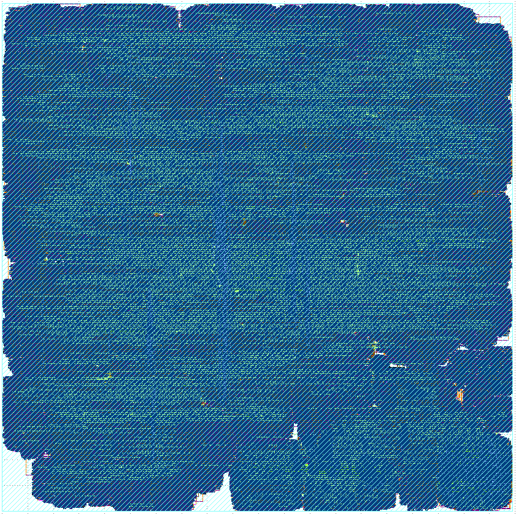

# air-soc
TEKNOFEST 2024 ÇİP TASARIMI MİKRODENETLEYİCİ KATEGORİSİ KASIRGA-HAVA

CV32E40P RISC-V Core IP based SoC

## Son Commit
30.08.2024 deadline'ı için [d19889fe20c4411b32c783840d87787adc001040](https://github.com/kasirgalabs/air-soc/tree/d19889fe20c4411b32c783840d87787adc001040) commitine bakılmalı.

## Son Sunum Linki

https://docs.google.com/presentation/d/1ugqjF8JFo_gyyB9aSaV-FCiMpsWivd3f

## Cadence ASIC Design

Flow asic klasöründe var, rapor ve çıktılarıyla tam hali aşağıdaki drive linkinde:

https://drive.google.com/file/d/1F1wVqM8RilMV8nuH__U9k4ssZyCk4paq/view?usp=sharing

Büyük oranda https://github.com/agh-riscv/mtm_ppcu_vlsi_riscv reposundaki scriptler kullanılıp gpdk045 pdk'si için uyarlanmıştır.



Akış okulda bulunan Cadence lisansı ile geçirildi, serverda da dosyalar yok fakat önbelleklerin küçültülebileceği söylenmişti, header.vh'ta minimum size olan 64 byte yapıldı. Yaklaşık 1000um x 1000um, 100MHz fakat 7 DRC hatası var.

## Ortam Kurulumu

Bu repoda nix tabanlı bir ortam kullanılmaktadır ve simülasyon ve derleme için gerekli araçlar Modelsim, riscv-gnu-toolchain, cocotb vs. otomatik olarak build edilir, kurulur. 

nix'i linux tabanlı işletim sisteminizde yüklemek için aşağıdaki komutları çalıştırın: 

```bash
sh <(curl -L https://nixos.org/nix/install) --daemon
```

```bash
mkdir -p $HOME/.config/nix && touch $HOME/.config/nix/nix.conf && echo -e "\n# Added by script\nexperimental-features = nix-command flakes\nmax-jobs = auto\nuse-xdg-base-directories = true" | tee -a $HOME/.config/nix/nix.conf
```

Sistemi yeniden başlatın:

```bash
reboot
```

nix'in yüklenip yüklenmediğini kontrol edin:

```bash
nix-shell -p nix-info --run "nix-info -m"
```

Repoyu klonlayın ve submoduleleri de update edin:

```bash
git clone https://github.com/kasirgalabs/air-soc
```

```bash
cd air-soc
```

```bash
git submodule update --init --remote --recursive
```

nix environmentini aktive etmek için aşağıdaki komutu kullanın (`conda activate` gibi her yeni terminal açıldığında kullanılmalıdır): 

```bash
nix develop
```

İlk seferde toolları kuracak ve bu biraz uzun sürebilir fakat bir kere kurulduktan sonra, sonraki her yeni terminalde beklemeden çalışma ortamına ulaşabileceksiniz.

** Önemli Not: ** Kullanılan hostta eğer Modelsim lisansınız yoksa Modelsim'i kullanabilmek için önce lisans edinmeniz gerekmektedir:

https://www.intel.com/content/www/us/en/docs/programmable/683472/22-1/and-software-license.html

Lisans alırken host bilgisayarın mac adresinizi girmeniz gerekmektedir. (`ifconfig`)

Sonrasında, `.bashrc`'de ya da her terminali açtığınızda:

```bash
export LM_LICENSE_FILE=<your-questa-license-file-with-full-path>
```

## Ortam Kullanımı

Kurulumu yaptıktan sonra repo ana pathine giderek her yeni terminal açtığınızda:

```
cd air-soc

nix develop
```

Sonrasında örneğin `tests` dosyasındaki demo programını compile etmek için:

```bash
make compile <program_ismi>
```

```bash
make compile demo
```

Modelsim ile simülasyonunu yapmak için:

```bash
make sim <program_ismi>
```

```bash
make sim demo
```

Simülasyon `tb_air.py` cocotb kodunda bulunan `TIMEOUT` değerine kadar çalışacaktır, eğer daha erken bitirip bakmak isterseniz Ctrl+C tuş kombinasyonunu kullanın.

Sonrasında waveformu görüntülemek için aşağıdaki komutu çalıştırın:

```bash
make show
```

Coremark için compile komutu özeldir:

```bash
make coremark
```

```bash
make sim coremark

make show
```

## Kendi Programınızı Yazma, Derleme ve Simüle Etme

Örneğin `example.c` adlı bir c kodu yazıp derlemek ve çalıştırmak istiyorsunuz, o zaman `tests` dosyasında `example` adlı bir dosya oluşturun. Bu dosyanın içinde dosya ismiyle aynı olacak şekilde (ve driver isimlerinden (uart.c, qspi.c, vs.) farklı olacak şekilde) c kodunuzu yazın. Sonrasında derlemek ve çalıştırmak için tek yapmanız gereken aynı şekilde:

```bash
make compile example

make sim example

make show
```

## BOOTLOADER ve BOOTROM

** Not: ** Bu kısımlar tam doğrulanmadı ve sıkıntılar var.

Buraya kadar hepsi `0x00000080` adresinden bootlanarak içerideki unified main memory'e yazılmaktadır. Eğer bootloader ile simülasyonda 2. bir program yüklenmek istenirse bootloader derlenmeli ve `header.vh` dosyasında `QSPI_SIM` define edilmeli, s25fl128 flash modeline ise örnek olarak `.mem_file_name("../../../tests/demo/demo.vmem"),` 2. programın vmem dosya yolu parametre olarak verilmeli. 2. program `BOOT=1` opsiyonuyla compile edilmeli. (linkeri ve start assemblysi farklı)

```bash
make compile bootloader

make compile demo BOOT=1

make sim bootloader
```

Eğer main memory'e yazılan verilog kodunun içindeki bootrom (içinde qspi'dan okuyan bootloader kodu var) kullanılacaksa `header.vh`'ta `USE_BOOTROM` parametresi `1` yapılır ve:

```bash
make compile demo BOOT=1

make sim bootloader
```
